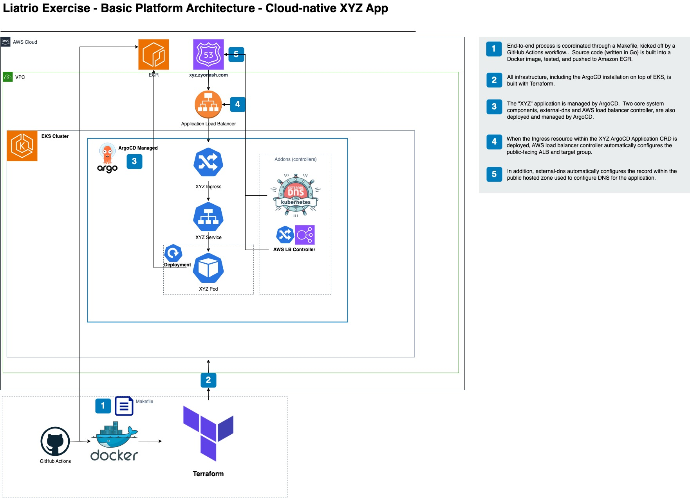

# xyz-eks-service
Code and documentation to create an EKS cluster, bootstrap it, and deploy/expose a simple Go REST API.  A Makefile exists as the entrypoint into each individual component of the process, along with an `all` target to run everything at once.  

GitHub Actions workflows are included to make deployment easier.  New container images are built and pushed on merges to main.  The deploy process for all infrastructure can be manually kicked off from GitHub.

---

## Overview
The Go app listens on port 8080 and returns a JSON payload consisting of a static message and a Unix format timestamp:
```
{"Message":"Automate all the things!","Timestamp":1699532803}
```

The app is unit tested, containerized and pushed to ECR. The underlying platform running the application is Amazon EKS.  EKS is fully configured and deployed through Terraform.  ArgoCD is then deployed on top of EKS to run the Go app and some core Kubernetes add-ons (external-dns, AWS load balancer controller). Once the EKS cluster is stood up and both the app and core Kubernetes components are fully deployed by ArgoCD, a final test is run to ensure everything is healthy.

---

## Usage

## Prerequisites:

### Running Locally
The xyz-eks-service repository holds all the necessary code to deploy the solution from a local machine, however, there are a few prerequisites: 

- [Terraform](https://developer.hashicorp.com/terraform/install) installed (version 1.5.7 or higher)
- AWS credentials set as environment variables
  - The policy/policies attached must be permissive enough to complete all necessary deployment steps, including VPC, EKS, IAM role (used for IAM Roles for Service Accounts or IRSA) creation and configuration.  
  - They must also be able to create the ECR repo and the S3 bucket for Terraform state.
  - Production recommendation would be to use a secrets manager like Hashicorp Vault or AWS Secrets Manager.  IAM Identity Center offers secure ways to generate temporary credentials as well.
- Docker installed (I used version 24.0.6, build ed223bc, and I used [Docker Desktop](https://www.docker.com/products/docker-desktop/) to manage my install)
  - Docker Desktop is free for non-enterprises.  Use [Rancher Desktop](https://docs.rancherdesktop.io/getting-started/installation/) if there are any licensing issues

### Running from GitHub
- Access to the GitHub Actions workflows in the repository

### General
- A domain and hosted zone in Route 53.   `external-dns` will handle creating the alias record to the ALB. 

Optional: If you want to run the Go service locally, or run the test, you'll need to install [Go](https://go.dev/doc/install)

---

## Deployment

GitHub Actions workflows are provided as an easy way to kick off deployments.  Available workflows include:

```
└── workflows
    ├── build-and-push.yaml - Run Docker build, test, tag and push - automated on merges, can be run manually
    ├── deploy-platform.yaml - Deploy all infrastructure managed by Terraform, deploy and configure ArgoCD
    ├── final-test.yaml - Run a smoke test
    ├── run-all.yaml - Run everything at once - this combines the Docker workflow with Terraform
    ├── teardown.yaml - Destroy everything 
    └── test.yaml - Run a simple unit test - this is kicked off on each opened/merged pull request 
```

A Makefile handles most of the heavy lifting.  Available Makefile targets include:

```
setup: Ensures S3 bucket and ECR repository are created.
build: Runs the Docker build against the Go service.
test: Runs a small unit test against the Go service.
push: Tags and pushes the Docker image to ECR.
init: Runs a Terraform init.
validate: Runs a Terraform validate.
plan: Runs a Terraform plan.
apply: Runs a Terraform apply.
argoInit: Runs a one-time deploy of the root app & child apps (App-of-apps strategy) in ArgoCD, and syncs the applications.
testCluster: Runs a small testing suite in Go to test for a healthy deployment and validate that the application's payload is correct.
destroy: Deletes the ArgoCD applications, then runs a Terraform destroy.  Also deletes the ECR repository.
allTF: Runs all Terraform steps, skips the Docker steps.
all: Runs all steps in sequential order, except destroy.
```

---

## EKS Components

EKS is deployed using the standard public EKS Terraform module.  A VPC and underlying networking services used by EKS are also deployed using the standard public module for VPC.  IRSA (IAM Roles for Service Accounts) are deployed with a public module in order for VPC CNI, external-dns and the AWS load balancer controller to have the appropriate amount of IAM permissions needed.

EKS is using a managed node group for its worker nodes.  Capacity is set to 1 to save on costs, running a m5.large instance.

Finally, the Go application itself is deployed to EKS through ArgoCD.  

---

## Architecture Diagram



## Helpful Tips

To login to the ArgoCD UI without directly exposing the API, port-forwarding can be used to gain local access:

```
kubectl port-forward svc/argocd-server -n argocd 8080:443
```

The initial password for the `admin` account can be obtained by running:

```
kubectl -n argocd get secret argocd-initial-admin-secret -o jsonpath="{.data.password}" | base64 -d
```

This is obviously not to be used this way in Production. Access to the ArgoCD UI should be private, and locked down with some kind of SSO + RBAC.

---

## Cleanup

Cleanup is done using `make destroy`.  This will delete the `apps` ArgoCD Application in cascading fashion, tear down all Terraform managed components, and delete the ECR repo.